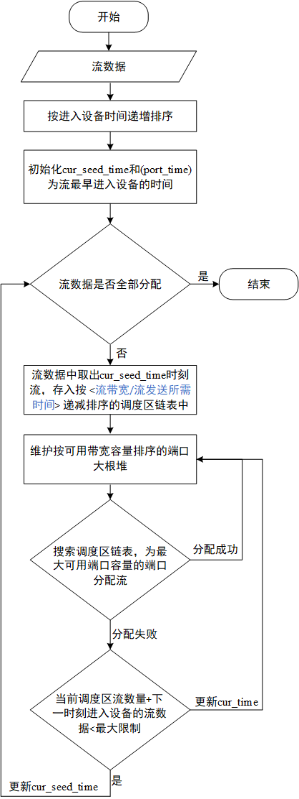

第二阶段的主要问题可以总结为：

1. 端口带宽利用率越高越好并且丢弃流的总时间越短越好；
2. 流调度区不能超过限制。

针对这两个问题，该代码用了贪心＋模拟的思路去解决。其中，对三个部分进行了贪心，第一，希望在单位时间内，发送的带宽越大越好；第二，端口剩余带宽越小越好；第三，丢弃流的<流带宽/流发送所需时间>值越大越好。模拟采用了按给定规则排序的链表去模拟流调度区，大根堆模拟端口正在发送的流，队列模型各个端口的缓存区。算法的步骤可以概况为:

1. 将全部流按进入设备时间递增排序；
2. 定义两个时间变量以便于防止调度区流超限和控制流的丢弃。它们分别是当前流的发送时间cur_seed_time和用于判断端口中流是否发送完成的时间port_time，它们初始化的时候都是最早进入设备的流的时间；
3. 按当前流的发送时间cur_seed_time取出流，存入按 <流带宽/流发送所需时间> 递减排序的链表中，该链表代表流调度区；
4. 维护按可用带宽容量排序的端口大根堆，根的位置就是可用带宽容量最大的端口；
5. 从2中的调度区链表的第一个元素开始搜索流，找到符合带宽要求的流将其分给剩余带宽最大的端口，若没有流符合要求，则通过更新port_time去更新端口的剩余流。再重复第4步，直至当前调度区的流数量加上下一时刻进入调度区的流数量不超限，则退出。
6. 更新cur_seed_time到下一个时刻，并重复第2步，直至所有流都被分配完毕。

算法流程图如下所示：

